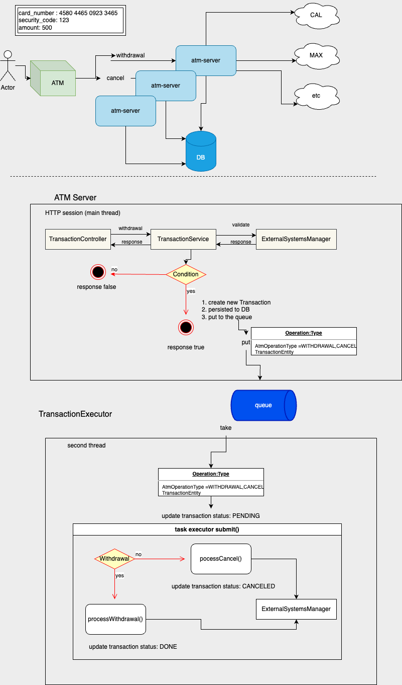

## Getting Started

### ATM Simulator Application
#### Uses
* java 17
* Spring Boot 3
* lombok
* Cache (coffine)
* Actuator
* Logback
* JPA

The project uses embedded in-memory H2 DB (for demo/test only).
* To manipulate H2 run on browser http://localhost:8080/h2-console and push the connect button.
* No needed to be extended configuration.

The application uses MVC for REST API:
* POST   http://localhost:8080/transactions withdrawal operation
* DELETE http://localhost:8080/transactions cancel previews withdrawal operation
   Request body format:
  {
  "cardNumber": 4536789143541122,
  "secretCode": 432,
  "amount": 300
  }

 

